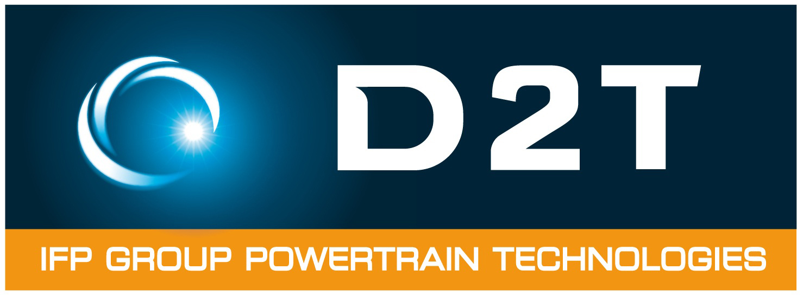

D2T is a worldwide supplier for powertrain development and calibration, test bed engineering and equipment.
With our state of the art automation, simulation and calibration tools, developed in cooperation with major OEMs, D2T is strongly involved in hybrid and electric powertrain design and validation.
D2T is a subsidiary of IFPEN.

D2T is your experienced partner for:
<ul>
    <li>Modeling, simulation and design</li>
    <li>Control, overall supervision and calibration</li>
    <li>Optimization, characterization and validation</li>
</ul>