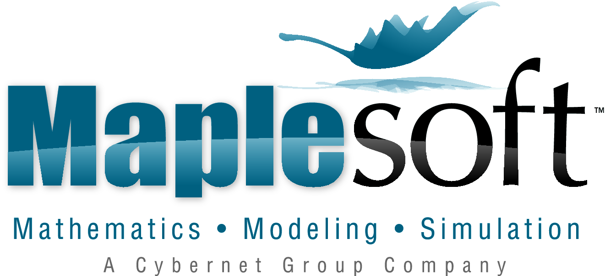

Maplesoft, a subsidiary of Cybernet Systems Co., Ltd. in Japan, is the leading provider of high-performance software tools for engineering, science, and mathematics.
Its product suite reflects the philosophy that given great tools, people can do great things.
Maplesoft’s core technologies include Maple, the world’s most advanced symbolic computation engine, and MapleSim, a Modelica-based physical modeling and simulation tool.
With MapleSim, you can leverage the growing collection of industry-tested Modelica components in your own projects.
Maplesoft’s customers include Ford, BMW, Bosch, Boeing, NASA, CSA, Canon, Motorola, Microsoft, Bloomberg, and DreamWorks, covering sectors such as automotive, aerospace, electronics, defense, and energy.

