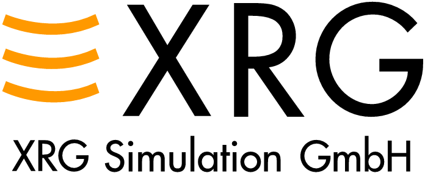

XRG Simulation has extended expertise in thermal energy system simulations in the automotive and building services field, for the aerospace and shipping industry and for power plants.
We are specialized in energy engineering and support industry and research institutions in research, development and improvement of products and projects.
Our excellence is:

<ul>
    <li>Modelling and simulation of thermodynamic systems</li>
    <li>Mathematical optimization</li>
    <li>Validation of models</li>
    <li>Software development for optimization as well as pre- and post-processing of system simulations</li>
</ul>